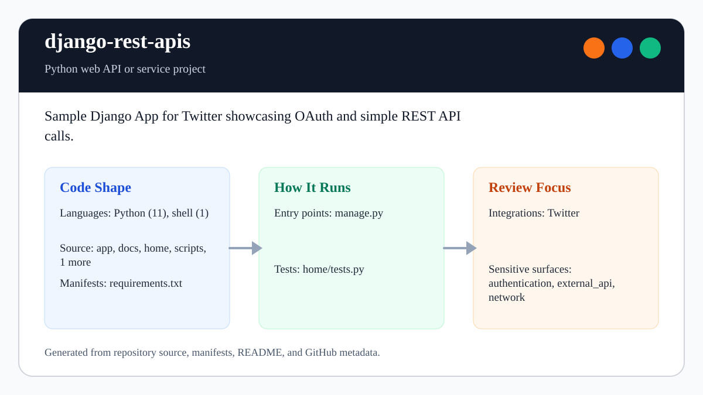

# django-rest-apis

<!-- README-OVERVIEW-IMAGE -->


## Overview

`garethpaul/django-rest-apis` is a Python web API or service project. Sample Django App for Twitter showcasing OAuth and simple REST API calls.

This README is based on the checked-in source, manifests, scripts, and repository metadata on the `master` branch. The project language mix found during review was: Python (11).

## Repository Contents

- `README.md` - project overview and local usage notes
- `requirements.txt` - Python dependency or packaging metadata
- `CHANGES.md` - maintenance history
- `app` - source or example code
- `home` - source or example code
- `manage.py`
- `SECURITY.md` - security reporting and disclosure guidance
- `Makefile` - repository-level verification wrapper
- `scripts/check-baseline.sh` - source-level settings security guard
- `templates` - source or example code
- `VISION.md` - project direction and maintenance guardrails

Additional scan context:

- Source directories: app, home, scripts, templates
- Dependency and build manifests: requirements.txt
- Entry points or build surfaces: manage.py, `Makefile`, `scripts/check-baseline.sh`
- Test-looking files: home/tests.py

## Getting Started

### Prerequisites

- Git
- Python matching the era of the project

### Setup

```bash
git clone https://github.com/garethpaul/django-rest-apis.git
cd django-rest-apis
export DJANGO_DEBUG=1
export DJANGO_SECRET_KEY=local-development-secret
export DJANGO_ALLOWED_HOSTS=localhost,127.0.0.1
export SOCIAL_AUTH_TWITTER_KEY=
export SOCIAL_AUTH_TWITTER_SECRET=
export TWITTER_ACCESS_TOKEN=
export TWITTER_ACCESS_TOKEN_SECRET=
```

Do not install these historical requirements into a modern environment.
`requirements.txt` preserves the Django 1.6-era dependency boundary for
archival reference; a runnable framework upgrade requires a dedicated
migration of Django settings, social authentication, templates, URLs,
migrations, and deployment tooling. The supported modern verification path is
the isolated standard-library helper suite behind `make check`.

The setup commands above are derived from repository files. Legacy mobile, Python, or JavaScript samples may require older SDKs or package versions than a modern workstation uses by default.

## Running or Using the Project

- Run Django management commands through `python manage.py ...`.
- The app is a legacy Django sample. Keep real Twitter OAuth credentials in
  environment variables or untracked local shell configuration.

## Testing and Verification

Run the source-level settings security guard before committing:

```bash
make check
scripts/check-baseline.sh
```

`make check` runs the source baseline and no-Django-runtime helper tests from
the repository root. The guard verifies that `DJANGO_SECRET_KEY`,
`DJANGO_DEBUG`, and Twitter credential settings are environment-driven and that
the old hardcoded `SECRET_KEY` is gone. It also runs no-Django-runtime settings
helper tests, checks POST-only status submission, Twitter status normalization,
rejection of non-string status values before provider writes,
safe Twitter status links, missing social OAuth token fallback, missing
social-auth row fallback, blank social OAuth token fallback, malformed social
OAuth token fallback, non-mapping social-auth metadata fallback, and pinned
legacy dependency ranges. It also verifies
that missing Twitter access tokens fail clearly before constructing the API
client. Expected Twitter posting and timeline errors are contained at the view
boundary, with generic messages that do not expose provider details and with
available timeline data preserved after posting failures. Successful status
posts redirect to `/home` before timeline loading so browser refreshes do not
resubmit the mutation. Valid list and tuple timeline responses remain
renderable; malformed timeline results become an empty timeline with the same
generic load error. Within accepted collections, malformed timeline items and
items whose provider attributes raise during validation reject the complete timeline
unless every item provides the ID, nonblank text, and user screen name required
by the template. Provider screen names are restricted to 1-15 ASCII letters,
digits, or underscores before template rendering, and blank timeline status text
is rejected before template rendering. Noncanonical local usernames are
rejected before timeline provider I/O without rewriting the account value.
Oversized timeline results beyond the requested ten statuses are rejected with
the same generic load error rather than rendered or silently truncated.
Provider timeline text longer than 280 characters rejects the complete result
before template rendering, while exact-limit text remains accepted.
Provider timeline status IDs outside the unsigned 64-bit range reject the
complete result before permalink rendering.
Lone-surrogate provider timeline text rejects the complete result before
response encoding while valid supplementary Unicode remains renderable.
`DJANGO_DEBUG`
parsing trims whitespace before evaluating boolean
environment values. When debug is disabled, Django session and CSRF cookies
always use the secure flag; debug-mode HTTPS testing can opt in with
`DJANGO_SECURE_COOKIES=1`. Logout is kept behind a
CSRF-protected POST-only form instead of a GET link.
GitHub Actions runs `make check` on Python 3.10, 3.12, and 3.14 for pushes,
pull requests, and manual dispatches on Ubuntu 24.04. The workflow uses commit-pinned actions,
read-only repository access, and a bounded runtime without installing the
unsupported Django 1.6 dependency set. It does not persist checkout credentials
after source retrieval.

Runtime and integration claims use the exact-head checklist in
[`RUNTIME_VERIFICATION.md`](RUNTIME_VERIFICATION.md). The checklist keeps
portable helper results separate from local Django, database, browser, OAuth,
social-auth provider, and live Twitter evidence.
It requires isolated synthetic accounts and sanitized results.

When the required SDK or runtime is unavailable, use static checks and source review first, then verify on a machine that has the matching platform toolchain.

## Configuration and Secrets

- Detected references to Twitter. Keep API keys, OAuth credentials, tokens, and account-specific values in local configuration only.
- Required environment variables for local app startup are:
  `DJANGO_SECRET_KEY`, `DJANGO_DEBUG`, `DJANGO_ALLOWED_HOSTS`,
  `DJANGO_SECURE_COOKIES`,
  `SOCIAL_AUTH_TWITTER_KEY`, `SOCIAL_AUTH_TWITTER_SECRET`,
  `TWITTER_ACCESS_TOKEN`, and `TWITTER_ACCESS_TOKEN_SECRET`.

## Security and Privacy Notes

- Review changes touching authentication or token handling; examples from the scan include app/settings.py, app/urls.py, home/views.py, requirements.txt, and 1 more.
- Review changes touching external API calls or credential-adjacent configuration; examples from the scan include app/settings.py, home/views.py, requirements.txt, templates/home.html, and 1 more.
- Review changes touching network requests, sockets, or service endpoints; examples from the scan include app/settings.py, app/urls.py, app/wsgi.py, fabfile.py, and 6 more.

## Maintenance Notes

- See `SECURITY.md` for vulnerability reporting and safe research guidance.
- See `VISION.md` for project direction and contribution guardrails.
- See `CHANGES.md` for maintenance history.
- See `docs/plans/2026-06-08-settings-helper-regression-tests.md` for the
  executable settings helper test plan.
- See `docs/plans/2026-06-08-twitter-token-fallback.md` for optional
  social-auth token fallback coverage.
- See `docs/plans/2026-06-09-twitter-social-auth-row-fallback.md` for missing
  social-auth row fallback coverage.
- See `docs/plans/2026-06-09-twitter-blank-token-fallback.md` for blank social
  OAuth token fallback coverage.
- See `docs/plans/2026-06-09-twitter-malformed-token-fallback.md` for
  malformed social OAuth token fallback coverage.
- See `docs/plans/2026-06-09-twitter-access-token-error.md` for the missing
  Twitter access tokens fail clearly guard.
- See `docs/plans/2026-06-09-django-env-bool-normalization.md` for boolean
  environment flag normalization.
- See `docs/plans/2026-06-09-post-only-logout.md` for the POST-only logout
  guard.
- See `docs/plans/2026-06-10-ci-baseline.md` for the hosted GitHub Actions
  baseline.
- See `docs/plans/2026-06-12-twitter-api-error-boundary.md` for stable posting
  and timeline failure handling.
- See `docs/plans/2026-06-13-twitter-timeline-type-guard.md` for malformed
  successful timeline response containment.
- See `docs/plans/2026-06-13-twitter-timeline-item-guard.md` for per-status
  template-field validation before rendering.
- See `docs/plans/2026-06-14-twitter-timeline-text-guard.md` for the nonblank
  provider text boundary.
- See `docs/plans/2026-06-12-twitter-post-redirect-get.md` for duplicate status
  submission prevention.
- See `docs/plans/2026-06-10-production-secure-cookies.md` for production
  session and CSRF cookie transport protection.

## Contributing

Keep changes small and tied to the project that is already present in this repository. For code changes, document the toolchain used, avoid committing generated dependency directories or local configuration, and update this README when setup or verification steps change.
